# Architecture

## System Overview

The High-Performance Content Delivery API is designed to minimize latency and maximize cache hit rates through strategic use of HTTP caching, CDN integration, and object storage.

### Architecture Diagram

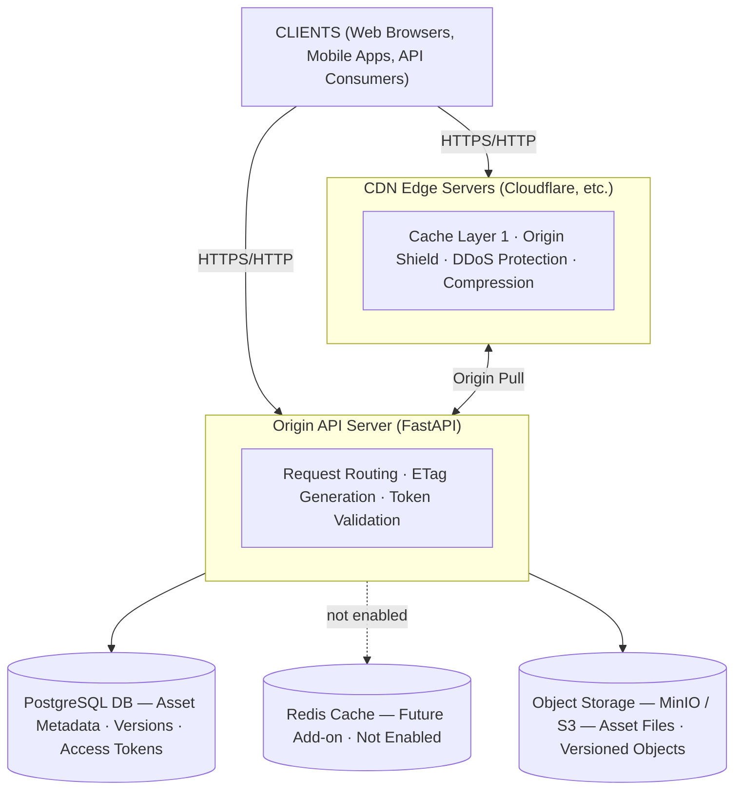

## Request Flow

### 1. Public Asset Download (Cached)

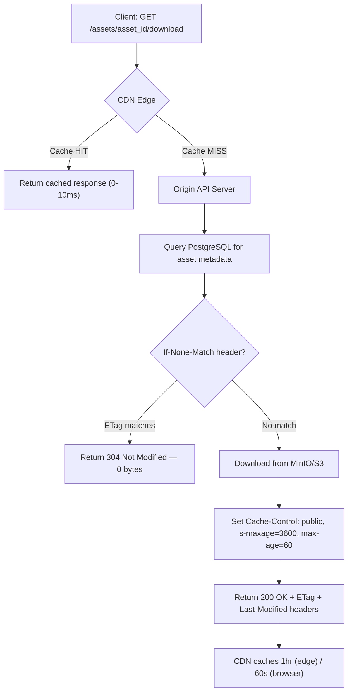

**Response Headers:**
```
HTTP/1.1 200 OK
ETag: "a1b2c3d4e5f6..."
Last-Modified: Wed, 10 Jan 2024 10:00:00 GMT
Cache-Control: public, s-maxage=3600, max-age=60
Content-Type: application/pdf
Content-Length: 1024000
X-Content-Type-Options: nosniff
```

### 2. Conditional Request (304 Not Modified)

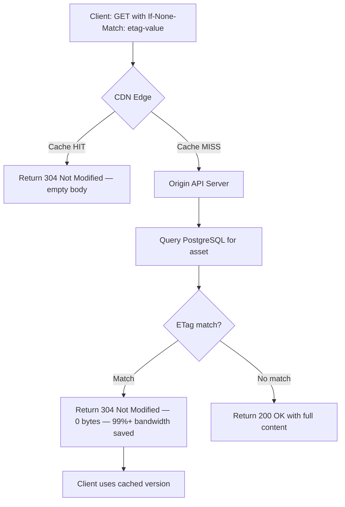

**Benefits:**
- Zero bytes transmitted
- Reduces bandwidth by 99%+
- Client uses cached version
- Very low latency response time at the edge

### 3. Private Asset Access (Token-Based)

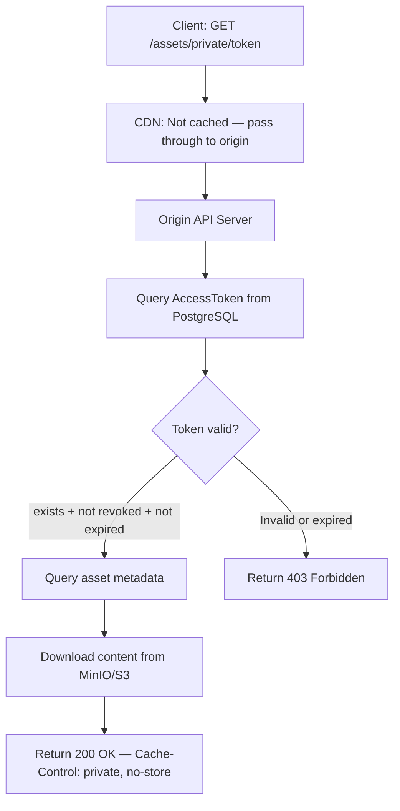

**Response Headers (Private):**
```
HTTP/1.1 200 OK
ETag: "x1y2z3a4b5c6..."
Cache-Control: private, no-store, no-cache, must-revalidate
Content-Type: application/pdf
X-Content-Type-Options: nosniff
```

### 4. Asset Upload Flow

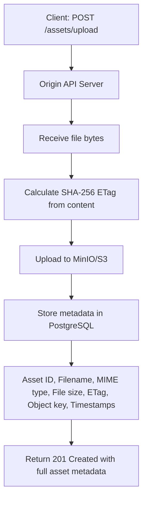

### 5. Asset Publishing (Versioning)

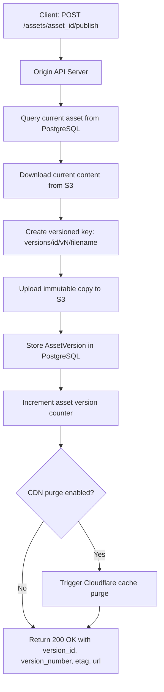

## Caching Strategy

### Three-Tier Cache Architecture

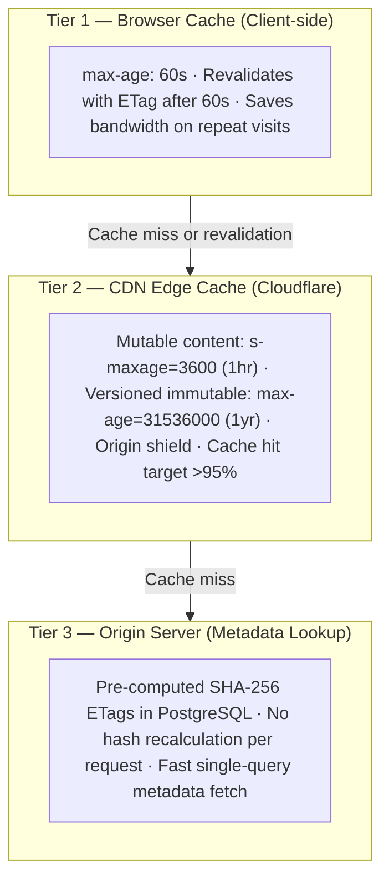

### Cache Directives

#### Immutable Content (Versioned)
```
Cache-Control: public, max-age=31536000, immutable
```
- Cached for 1 year (31536000 seconds)
- Never expires
- Immutable flag prevents revalidation
- Safe for versioned URLs

#### Mutable Content (Latest)
```
Cache-Control: public, s-maxage=3600, max-age=60
```
- Browser: 60 seconds (max-age)
- CDN: 3600 seconds (s-maxage)
- After browser cache expires, revalidates
- CDN holds longer for efficiency

#### Private Content
```
Cache-Control: private, no-store, no-cache, must-revalidate
```
- Not cached by CDN
- Not stored in browser cache
- Always revalidates
- Required for sensitive content

## ETag Strategy

### Strong ETag Generation

```python
import hashlib

def generate_etag(content: bytes) -> str:
    """Generate strong ETag using SHA-256"""
    hash_value = hashlib.sha256(content).hexdigest()
    return f'"{hash_value}"'
```

**Advantages:**
- SHA-256 provides collision resistance
- Changes for any byte modification
- Stored in DB (no recalculation)
- Used for 304 Not Modified responses

### ETag-Based Conditional Requests

```
Client: GET /assets/123
Server Response:
  HTTP/1.1 200 OK
  ETag: "a1b2c3d4e5f6..."
  
Client (later):
  GET /assets/123
  If-None-Match: "a1b2c3d4e5f6..."
  
Server (matching ETag):
  HTTP/1.1 304 Not Modified
  (empty body - 0 bytes!)
  
Client: Uses cached version
```

## Security Architecture

### Access Token System

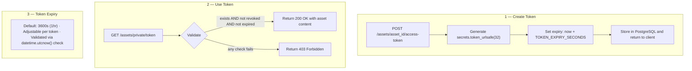

### Origin Protection

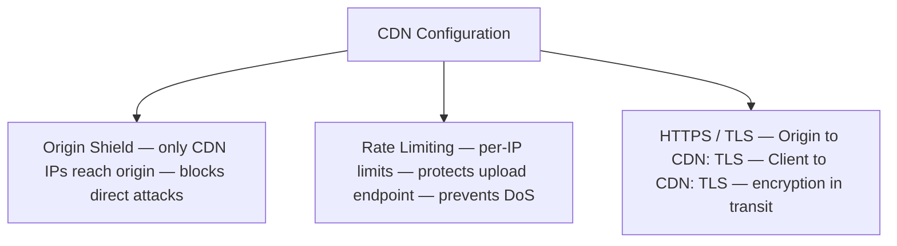

## Scalability Considerations

### Horizontal Scaling

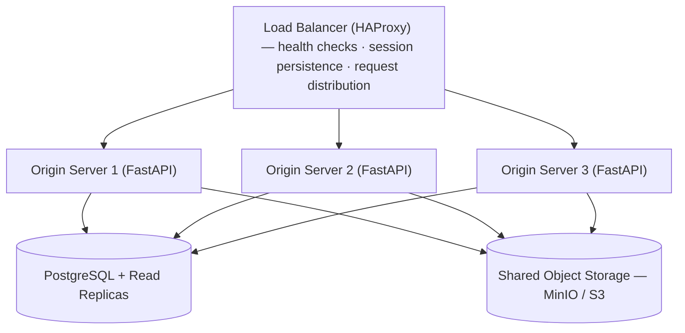

### Database Optimization

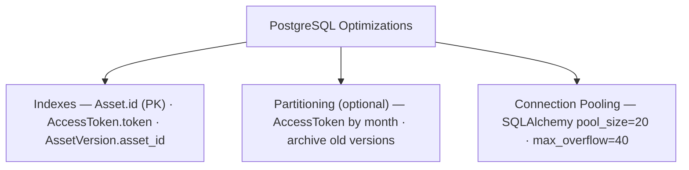

## Performance Optimizations

### 1. ETag Caching
- ETags pre-calculated during upload
- No expensive hash calculations per request
- Direct database lookup

### 2. Conditional Response Handling
- Fast string comparison
- Return 304 with empty body
- Saves 99% of bandwidth

### 3. CDN Configuration
- Aggressive caching for public content
- Origin shield to reduce backend load
- Cache purging on updates (optional)

### 4. Object Storage
- Async uploads to S3/MinIO
- Buffered downloads (current implementation)
- Signed URLs for direct access

## Monitoring & Observability

### Metrics to Track

**Performance Metrics:**
- Response time (p50, p95, p99)
- Cache hit ratio (>95% target)
- Error rates (4xx, 5xx)
- Request throughput (req/sec)
- Bandwidth saved by caching

**Business Metrics:**
- Assets uploaded (count)
- Total storage used (GB)
- Private vs public asset split
- Token generation rate

### Logging

**Request Logging:** Timestamp · Method · Path · Status · Response time · Cache status · User agent

**Application Logging:** Upload operations · Token creation/validation · CDN purge operations · Errors and exceptions

## Disaster Recovery

### Backup Strategy

1. **Database Backups** — Daily · 30-day retention · S3 backup bucket · Restore time: <5 minutes
2. **Asset Backups** — Continuous via S3 versioning · Per-bucket retention policy · Multi-region optional · Restore time: <1 minute
3. **Configuration Backups** — On change · Stored in Git · Version controlled

## Summary

This architecture prioritizes:
1. **Performance**: Multi-tier caching, conditional requests
2. **Scalability**: Stateless origin servers, distributed caching
3. **Reliability**: Database backups, monitoring
4. **Security**: Token-based access, origin protection
5. **Cost-efficiency**: Reduced bandwidth, origin load